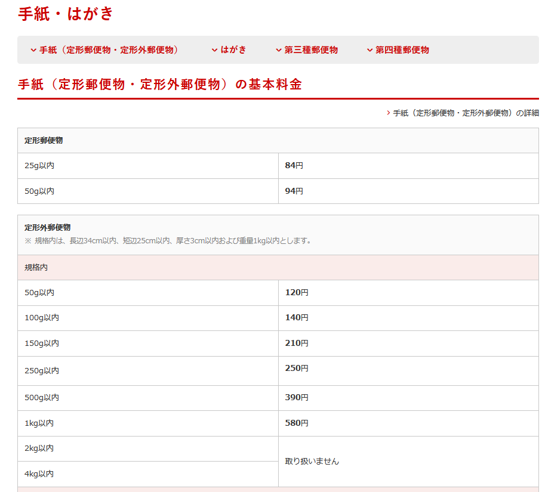

# 事務関連マニュアル
## 休日出勤について
前日の昼までに上長と相談のうえ、社長へ個別に申請します。
**休日出勤時のタイムカードの打刻漏れ**には特に注意してください。最悪、認められないケースも発生するので、慎重に対応をお願いします。
## 経費の精算について
主な適用項目は次のとおりです。
- 資料代
- 通信費
- 消耗品費
- 交通費

|適用　|内容
|--|--
|資料代  |書籍 有料アプリ
|通信費  |切手 宅配便料金
|消耗品費  |文具 台所用品
|交通費　|電車、バス代

## 宅配便の発送について
伝票を貼って荷物の準備をしておき、webサイトにアクセスして集荷依頼をします（http://example.com/takuhai)。
または電話で集荷を手配しても構いません。
## 電話、来客対応について
## ゴミ収集について
## プリンタについて
### プリンタドライバのインストール
ダウンロードページ（http://example.com/printer_driver)よりOSに合わせたドライバをダウンロードしてください。

macOSではシステム環境設定の「プリンタとスキャナ」を開き、「＋」ボタンをクリックしてプリンタを追加します。

## 大容量データの送受信について
- 送信　5Mbを目安（受け取り側のメールサーバの許容量）にこれ以上についてはクラウドサービズのファイル共有、送信サービスを利用してください。ただし、必ず**パスワード付きzipファイル**に変換し、相手の受け取りを確認したら、サーバから速やかに削除するようにしてください。
- 受信　送信先が信用できるかどうかをよく確認してください。**面識のない送信先であれば受信しない**でください。また、判断できない場合は相手にメール等で確認をとってください。
